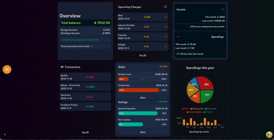

# Personal Finance Dashboard
A one-page personal finance dashboard.
---
To test the application, you can use the demo account, which contains some dashboard information for testing purposes.
---
DEMO ACCOUNT
---
email: testUser@example.com
---
password: Abc123
---
## Tech Stack
* **React**
* **Next.js**
* **TypeScript**
* **TailwindCSS**
* **Framer Motion**

## Demo

### Features
The dashboard contains features such as: 
-Sign up and log in, with authorization handled with NextAuth.
-Overview of financial assets.
-Search for Transactions and Upcoming Charges.
-Debts and Savings visualization.
-Spendings graphs.

#### Details
The application is fully responsive and follows accessibility best practices (semantic HTML and aria-labels).
---
Create by zgfpeter